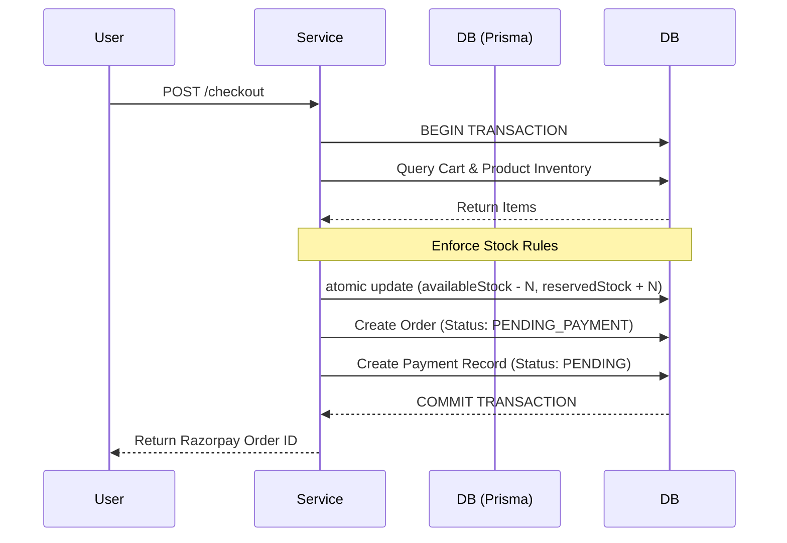

# Cravo - Multi-Vendor Hyper-Local E-Commerce Platform

Cravo is a full-stack, multi-tenant hyper-local e-commerce platform that seamlessly connects Customers, Sellers (Vendors/Shops), and Administrators. The system features real-time WebSocket notifications, automated background shipping and order maintenance workers, flexible payment processing, and a scalable containerized deployment architecture.

---

## 🏗️ High-Level System Architecture

```
                                 ┌────────────────────────┐
                                 │     Client Browser     │
                                 └───────────┬────────────┘
                                             │
                                   HTTP / REST / WebSockets
                                             │
                                             ▼
                                  ┌──────────────────────┐
                                  │   Nginx Web Server   │
                                  │  (Frontend App Port) │
                                  └──────────┬───────────┘
                                             │
                                             ▼
                                  ┌──────────────────────┐
                                  │   Node.js / Express  │
                                  │   Backend API (v1)   │
                                  └─┬───┬─────┬──────┬───┘
                                    │   │     │      │
           ┌────────────────────────┘   │     │      └────────────────────────┐
           ▼                            ▼     ▼                               ▼
  ┌─────────────────┐        ┌─────────────┐  ┌──────────────────┐  ┌──────────────────┐
  │ PostgreSQL (DB) │        │ Redis Store │  │ BullMQ Queue     │  │ Socket.io Engine │
  │ (Prisma ORM)    │        │ Rate-Limit /│  │ Workers (Jobs)   │  │ (Redis Adapter)  │
  └─────────────────┘        │ PubSub/Cache│  └──────────────────┘  └──────────────────┘
                             └─────────────┘
                                                      │
                                                      ▼
                                       ┌────────────────────────────┐
                                       │    External Services       │
                                       │ Delhivery | Razorpay       │
                                       │ Resend    | Cloudinary     │
                                       └────────────────────────────┘
```

---

## 🛠️ Technology Stack Breakdown

### 1. **Frontend (`/apps/frontend`)**
- **Core Framework & Build Tool**: React 19 bundled with Vite 8.
- **Routing**: React Router DOM (v7) supporting nested layouts.
- **State Management**:
  - **Client UI & Local State**: Zustand (`auth.store.js`, `cart.store.js`, `notification.store.js`).
  - **Server State & Caching**: TanStack React Query (v5) for data fetching, caching, automatic refetching, and optimistic updates.
- **Styling & UI**:
  - Tailwind CSS v4 + Lucide React icons.
  - Framer Motion for interactive UI animations.
  - Sonner for toast notifications.
- **Forms & Validation**: `react-hook-form` integrated with `zod` validation schemas via `@hookform/resolvers`.
- **Real-Time Engine**: `socket.io-client` for live status and notification feeds.
- **Authentication**: JWT authentication with HttpOnly cookies / Bearer tokens and Google OAuth SSO (`@react-oauth/google`).

---

### 2. **Backend (`/apps/backend`)**
- **Runtime Environment**: Node.js ES Modules (`"type": "module"`).
- **Core Web Framework**: Express 5 (`express@^5.2.1`).
- **Database & ORM**: PostgreSQL 15 accessed via Prisma ORM (`@prisma/client`).
- **Cache & In-Memory Store**: Redis (`redis@^6.0.0`) used for:
  - Distributed Rate Limiting (`express-rate-limit` + `rate-limit-redis`).
  - Token blacklisting and session management.
  - Socket.io Redis Adapter for multi-instance event scaling.
- **Background Tasks & Queue Management**: BullMQ powered by Redis for background processing:
  - **Delhivery Sync Worker**: Shipping status polling and synchronization.
  - **Order Maintenance Worker**: Auto-expiring unpaid orders.
  - **Campaign Expiry Worker**: Managing dynamic seller promotion windows.
  - **Sitemap Worker**: Generating SEO sitemaps asynchronously.
  - Built-in Queue Dashboard via `@bull-board/express` at `/api/admin/queues`.
- **Real-Time Communication**: Socket.io (`socket.io@^4.8.3`) with Redis Pub/Sub adapter.
- **Logging & Monitoring**: `pino` & `pino-pretty` structured logger with HTTP request middleware.
- **API Documentation**: Interactive Swagger UI at `/api-docs`.

---

### 3. **Integrations & Third-Party APIs**
- **Logistics & Shipping**: **Delhivery API** (Real-time shipping rates, waybill generation, pickup scheduling, tracking webhooks).
- **Payments**: **Razorpay** (Checkout sessions, webhook signature verification, refunds).
- **Cloud Storage**: **Cloudinary** (Product media, shop banners, seller verification document storage).
- **Email Delivery**: **Resend** (Transactional emails, verification codes, password reset links).

---

### 4. **Infrastructure & Deployment**
- **Docker Compose**: Orchestrates 4 isolated services (`cravo_frontend`, `cravo_backend`, `cravo_postgres`, `cravo_redis`).
- **Nginx Web Server**: Multi-stage production frontend Docker image serving static assets via Nginx on port 8080 (mapped to port 80).
- **Process Management**: PM2 zero-downtime deployment support (`process.send('ready')`).

---

## 📂 Repository Structure

```
cravo/
├── apps/
│   ├── backend/               # Express 5 REST API & WebSocket server
│   │   ├── prisma/            # Database schema & migrations
│   │   ├── src/
│   │   │   ├── config/        # Environment & service configurations
│   │   │   ├── lib/           # Socket & database connections
│   │   │   ├── modules/       # Domain modules (auth, orders, products, sellers...)
│   │   │   ├── routes/        # Router registrations
│   │   │   └── shared/        # Middlewares, utils, and queue managers
│   │   └── Dockerfile
│   └── frontend/              # React 19 + Vite SPA
│       ├── src/
│       │   ├── components/    # Common UI components
│       │   ├── features/      # Feature modules (admin, seller, cart, orders...)
│       │   ├── hooks/         # Custom React hooks
│       │   ├── lib/           # Axios & socket clients
│       │   └── store/         # Zustand global stores
│       ├── Dockerfile
│       └── nginx.conf
├── docker-compose.yml         # Full-stack multi-container Docker compose config
└── package.json               # Root scripts for monorepo development
```

---

## 🔄 The Request Lifecycle (How it works)

When an API request hits the backend (e.g., `POST /api/v1/orders/checkout`), it follows this strict pipeline:

1. **Helmet & CORS**: Secures HTTP headers and enforces cross-origin policies.
2. **Rate Limiter (`rateLimit.middleware.js`)**: Checks Redis to ensure the IP hasn't exceeded the API threshold.
3. **Auth Middleware (`auth.middleware.js`)**: 
   - Extracts the JWT from the `Authorization: Bearer <token>` header.
   - Verifies the signature.
   - Attaches the decoded `req.user`.
4. **Role Middleware (`role.middleware.js`)**: (Optional) Ensures `req.user.role` is `CUSTOMER`, `SELLER`, or `ADMIN`.
5. **Validator (`validate.middleware.js`)**: Parses `req.body` against a Zod schema. If invalid, throws a 400 Bad Request instantly.
6. **Controller (`order.controller.js`)**: Invokes `orderService.placeOrder(req.user.id, validatedData)`.
7. **Service (`order.service.js`)**: Contains the business logic. Opens a database transaction.
8. **Repository (`order.repository.js`)**: Executes the Prisma SQL.
9. **Response**: Controller formats the response using `apiResponse.js` and sends 200 OK.
10. **Error Handler (`error.middleware.js`)**: If any step `throw`s an `AppError`, this catch-all middleware intercepts it, logs it via Pino, and sends a formatted JSON error response.

---

## 🔍 Deep Dive: Key Operational Workflows

### 4.1 Order Placement & Inventory Locking
**Goal**: Prevent "overselling" where two customers buy the last item simultaneously.


**Working**: Instead of merely checking if `stock > 0`, the system uses an atomic SQL update constraint. If the update affects `0` rows (meaning stock dropped below the required amount mid-flight), the transaction aborts safely.

### 4.2 Webhook Idempotency (Payments & Refunds)
**Goal**: Handle delayed, duplicate, or out-of-order webhooks from Razorpay safely.

**Working**:
1. Razorpay fires `payment.captured`.
2. The `handleWebhook` service verifies the `x-razorpay-signature` cryptographically.
3. It extracts the Razorpay Order ID and finds the local `Payment`.
4. **Idempotency Lock**: The code runs `updateMany` checking `where: { status: 'PENDING' }`. 
5. If `updateResult.count === 0`, the system knows this webhook is a duplicate or the payment is already processed, and gracefully ignores it.
6. If successful, it updates `Order` to `PLACED` and fires an `ORDER_PLACED` websocket notification to the seller.

### 4.3 Idempotent Refund Architecture
**Goal**: Ensure a user mashing the "Refund" button or encountering a network timeout doesn't drain funds.

**Working**:
1. Client requests a refund, sending an `Idempotency-Key` in the HTTP header.
2. The backend opens a `SELECT ... FOR UPDATE` lock on the `Payment` row. This pauses any parallel requests for the same payment.
3. It checks `tx.refund.findFirst({ receipt: Idempotency-Key })`. If found, it returns the existing request (API bypassed).
4. **Amount Validation**: It aggregates existing refunds. If `requested + existing > paymentAmount`, it throws a 400 error.
5. It creates a `PENDING` refund in the DB.
6. It calls the Razorpay API. If the network drops, the `catch` block intercepts it, leaving the record `PENDING` rather than `FAILED`. Webhooks eventually arrive to reconcile it securely.

### 4.4 Background Jobs (BullMQ)
**Goal**: Offload slow tasks (Email, Logistics polling, Heavy analytics) from the main API thread.

**Working**:
- When an order is placed, `order.service.js` calls `QueueManager.getQueue('notifications').add(...)`.
- Redis stores the job.
- A separate BullMQ worker process (running natively within the server or as a sidecar) picks up the job.
- **Example**: The `notification.job.js` worker processes the payload, calls the Resend API to send an email, and marks the job as `COMPLETED`. Retries are handled natively by BullMQ if Resend times out.

### 4.5 Real-time Notifications (Socket.io)
**Goal**: Push alerts to sellers and buyers without them refreshing the page.

**Working**:
- The backend `server.js` initializes `Socket.io` and binds it to the Express HTTP server.
- Clients connect and authenticate using their JWT.
- They are placed into "Rooms" (e.g., `user_123_room`).
- When `payment.service.js` verifies a payment, it calls `notificationService.createAndEmit()`.
- This saves a `Notification` to the DB, and then calls `io.to('user_seller_456').emit('notification', data)`.
- The seller's frontend instantly displays a toast: *"New Order Received! 🛍️"*.

---

## ⚡ Getting Started

### Prerequisites
- Node.js (v20+) & npm
- Docker & Docker Compose (optional, for containerized execution)
- PostgreSQL 15+ & Redis 7+ (if running locally without Docker)

### Running with Docker Compose (Recommended)

1. Clone the repository:
   ```bash
   git clone <repository-url>
   cd cravo
   ```

2. Setup environment variables:
   Copy `.env` variables into `apps/backend/.env` and `apps/frontend/.env`.

3. Launch all services:
   ```bash
   docker-compose up --build -d
   ```

4. Access the applications:
   - **Frontend App**: `http://localhost`
   - **Backend API**: `http://localhost:5000`
   - **Swagger API Docs**: `http://localhost:5000/api-docs`
   - **BullMQ Admin Dashboard**: `http://localhost:5000/api/admin/queues`

---

## 📜 License

ISC License.
